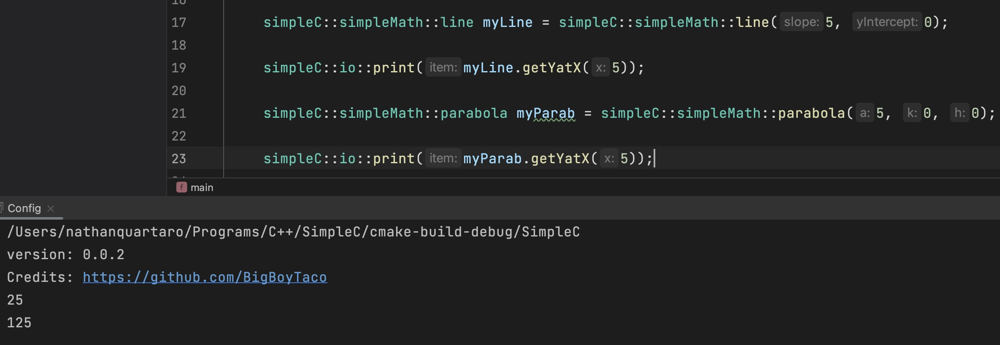
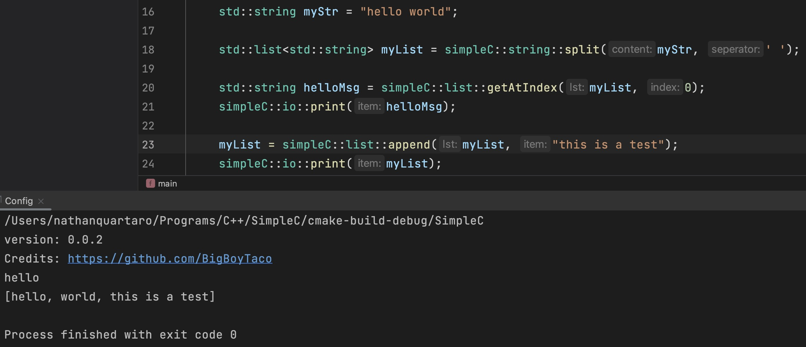
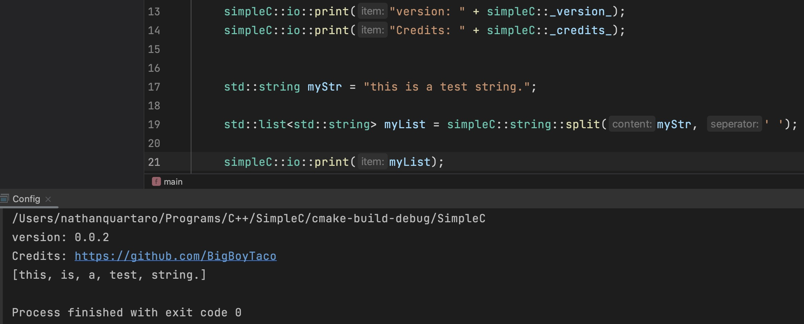
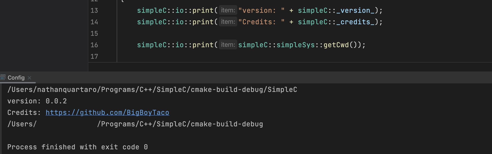

# simpleC
simpleC is a collection of tools designed to make people transitioning from other languages to c++ easy and familiar 

# what simpleC is not
simpleC IS NOT designed to be a permanent solution to the way c++ is written; it is designed to aid new c++ developers who want to learn the language but find that it is darastically different from what their used to (Ex: python -> c++). simpleC shouldn't be relied on by people who know c++ well.

# whats in simpleC
 - simpleIo is a basic in out system

 - simpleList is a easy way to manage and work with lists
 
 - simpleMath is a easy way to do some math (v basic right now)

- simpleString is a easy way to work with strings

- simpleSys is an easy way to use system functions (v basic right now)

